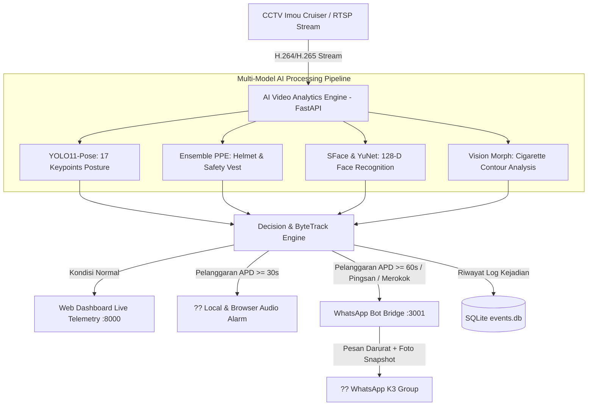

# ??? AI K3 Electrical Room Monitoring & Safety Alert System

> **Kategori:** Computer Vision / Workplace Safety (K3) / IoT  
> **Status:** Production Ready  
> **Tech Stack:** Python 3.10+, FastAPI, YOLO11 (Pose & Detection), OpenCV SFace & YuNet, ByteTrack, SQLite, Baileys WhatsApp Bridge, RTSP Stream  
> **Repository:** [https://github.com/Pandujatip/ai-electrical-room-monitor](https://github.com/Pandujatip/ai-electrical-room-monitor)

---

## ?? Project Overview & STAR Case Study

### ?? Situation (Latar Belakang)
Ruang elektrikal tegangan tinggi (*high-voltage switchgear*) dan transformator di industri semen merupakan area dengan risiko keselamatan tinggi (bahaya *arc flash*, sengatan listrik, dan kebakaran). Pemantauan kepatuhan Alat Pelindung Diri (APD) dan deteksi kondisi darurat personil (seperti pingsan/jatuh atau merokok di dekat panel listrik) sebelumnya dilakukan secara manual atau mengandalkan CCTV konvensional tanpa sistem peringatan otomatis.

### ?? Task (Tantangan & Sasaran)
Membangun sistem *AI Video Analytics* cerdas secara *end-to-end* yang beroperasi 24/7 di atas aliran video CCTV (RTSP) untuk:
1. Mendeteksi kepatuhan APD (Helm Keselamatan & Rompi K3 dengan variasi warna: Orange, Hijau Neon, Lime Stabilo).
2. Mengenali identitas personil secara biometrik (Face Recognition 128-D).
3. Mendeteksi aksi berbahaya secara otomatis: Merokok (*Smoking Action Recognition*) dan Personil Pingsan/Jatuh (*Man-Down Emergency Alert*).
4. Memicu alarm audio lokal serta mengirimkan notifikasi instan berupa snapshot foto ke grup WhatsApp K3 tanpa biaya API berbayar.

### ?? Action (Arsitektur & Implementasi Teknis)
- **Multi-Model AI Pipeline:**
  - **YOLO11-Pose (17 Keypoints):** Mengekstraksi postur tubuh dan geometri biometrik untuk membedakan gestur tangan-ke-mulut (*hand-to-mouth*) saat merokok serta menghitung sudut kemiringan tulang belakang $\theta \ge 38^\circ$ untuk deteksi pingsan (*man-down vs sitting*).
  - **Ensemble PPE Detection:** Deteksi helm dan rompi K3 dengan filter saturasi & fluoresensi khusus untuk meniadakan *false positive* dari pakaian sipil biasa.
  - **OpenCV SFace & YuNet:** Ekstraksi fitur wajah biometrik 128 dimensi dengan pendaftaran langsung dari snapshot kamera (*Live Snapshot Registration*).
  - **ByteTrack Persistent Tracking:** Mempertahankan tracking ID unik per orang untuk menghitung *dwell time* di dalam ruangan secara presisi.
- **Microservices & Notification Engine:**
  - Backend berbasis **FastAPI** dengan streaming telemetri real-time.
  - Microservice **WhatsApp Bridge (Node.js Baileys)** yang terhubung via QR Code scan web, dilengkapi mekanisme *anti-spam cooldown* (3600 detik per violator).
  - Peringatan suara lokal berbahasa Indonesia otomatis saat pelanggaran APD $\ge 30	ext{ detik}$.
- **Quality Assurance & Testing:**
  - Menulis **32 unit test otomatis** menggunakan framework `unittest` Python yang memvalidasi pipeline deteksi APD, gestur merokok, postur jatuh, dan dispatch notifikasi.

### ?? Result & Impact (Hasil & Metrik)
- **32 / 32 Unit Tests Passed:** Seluruh skenario deteksi tervalidasi secara deterministik.
- **Zero-Cost Alerting:** Berhasil mengintegrasikan pengiriman snapshot WhatsApp otomatis tanpa ketergantungan API pihak ketiga berbayar.
- **Deteksi Real-Time Berakurasi Tinggi:** Mampu membedakan postur orang duduk santai vs pingsan telentang di lantai ruang switchgear dengan ambang batas sudut $\ge 38^\circ$.

---

## ??? System Architecture



---

## ?? Key Code Highlight: Decision & Fall Detection Logic

```python
# Cuplikan logika diferensiasi postur jatuh vs duduk pada detector.py
def evaluate_man_down_posture(keypoints, box):
    """
    Menganalisis kemiringan tulang belakang (Spine Angle) & Rasio Aspek
    untuk membedakan jatuh pingsan (horizontal) vs duduk tegak.
    """
    nose, l_shoulder, r_shoulder, l_hip, r_hip = keypoints[0], keypoints[5], keypoints[6], keypoints[11], keypoints[12]
    
    mid_shoulder = ((l_shoulder[0] + r_shoulder[0]) / 2, (l_shoulder[1] + r_shoulder[1]) / 2)
    mid_hip = ((l_hip[0] + r_hip[0]) / 2, (l_hip[1] + r_hip[1]) / 2)
    
    dx = abs(mid_shoulder[0] - mid_hip[0])
    dy = abs(mid_shoulder[1] - mid_hip[1])
    
    # Sudut kemiringan terhadap bidang horizontal
    angle_degrees = math.degrees(math.atan2(dy, dx))
    
    # Deteksi jatuh: tulang belakang hampir horizontal (dy < dx) dan rasio bounding box memanjang horizontal
    is_spine_flat = angle_degrees <= 38.0
    aspect_ratio = (box[2] - box[0]) / max(1, (box[3] - box[1]))
    
    return is_spine_flat and aspect_ratio > 1.2
```
