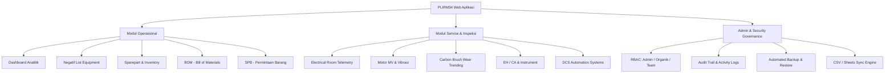

# ? PLIRM34 Web Aplikasi - Industrial Maintenance & Reliability Platform

> **Kategori:** Industrial IoT / Enterprise Maintenance ERP / Full-Stack Web  
> **Status:** Live Operational  
> **Tech Stack:** Python (Backend Server), Vanilla JavaScript, CSS3/HTML5, SQLite, Spec-Driven Development, Multi-role RBAC, Local LAN Access  
> **Repository:** [https://github.com/Pandujatip/PLIRM34-WEB-APLIKASI](https://github.com/Pandujatip/PLIRM34-WEB-APLIKASI)

---

## ?? Project Overview & STAR Case Study

### ?? Situation (Latar Belakang)
Unit Pemeliharaan Listrik & Instrumen Raw Mill 3-4 (PLIRM34) di pabrik semen mengelola ratusan aset kritikal (Motor MV, Trafo, Panel Switchgear, Dust Collector, Bag Filter, dan Sistem DCS). Sebelumnya, pencatatan hasil inspeksi preventif, keausan *carbon brush*, penggantian komponen, dan daftar suku cadang dilakukan secara parsial melalui formulir kertas atau spreadsheet terpisah, sehingga menyulitkan analisis tren prediktif dan audit trail.

### ?? Task (Tantangan & Sasaran)
Merancang dan membangun aplikasi web operasional terpusat berbasis **Spec-Driven Development** yang dapat diakses langsung oleh teknisi lapangan via jaringan LAN (PC dan Smartphone) untuk:
1. Mendigitalisasi seluruh checklist inspeksi preventif pada 6 modul utama: *Electrical Room*, *Motor MV*, *Motor MV (Carbon Brush)*, *EH/CA*, *Instrument*, dan *DCS*.
2. Memonitor tren keausan *carbon brush* secara dinamis dan mendeteksi titik pergantian sebelum terjadi *flashover*.
3. Menerapkan *threshold alarms* otomatis untuk parameter krusial trafo (suhu winding/oil) dan baterai charger.
4. Menyediakan sistem Role-Based Access Control (Admin, Organik, Team) serta audit trail logging lengkap.

### ?? Action (Arsitektur & Implementasi Teknis)
- **Spec-Driven Architecture:** Membagi spesifikasi sistem ke dalam 4 folder standar: `specs/product/` (alur menu & modul), `specs/api/` (kontrak endpoint), `specs/data/` (skema data SQLite), dan `specs/acceptance/` (checklist verifikasi fitur).
- **Backend & Database:** Backend Python murni dengan RESTful routing modular dan basis data SQLite relasional (`plirm34.db`), dilengkapi mekanisme isolasi data privat runtime di folder terpisah (`../.plirm34-data/`) untuk keamanan asset.
- **Predictive Analytics & Thresholds:**
  - Algoritma monitoring laju keausan *carbon brush* ($mm/	ext{jam operasi}$) dengan penandaan titik batas minimum aman.
  - Evaluasi otomatis parameter suhu belitan (*winding*) trafo $> 90^\circ	ext{C}$ dan deviasi tegangan sel baterai charger.
- **Enterprise Capabilities:** Fitur backup/restore 1-klik, import data operasional dari CSV/Google Sheets, serta export laporan summary teknis.

### ?? Result & Impact (Hasil & Metrik)
- **100% Digitalisasi Inspeksi PLIRM34:** Menggantikan formulir fisik dengan checklist digital yang tersinkronisasi instan ke dashboard admin.
- **Preventive Maintenance Optimization:** Mencegah potensi trip motor MV utama akibat keausan *carbon brush* lewat notifikasi tren prediktif.
- **Zero-Latency LAN Access:** Aplikasi dapat diakses secara simultan dari HP teknisi di lapangan tanpa memerlukan koneksi internet eksternal.

---

## ??? Modul & Fitur Sistem

